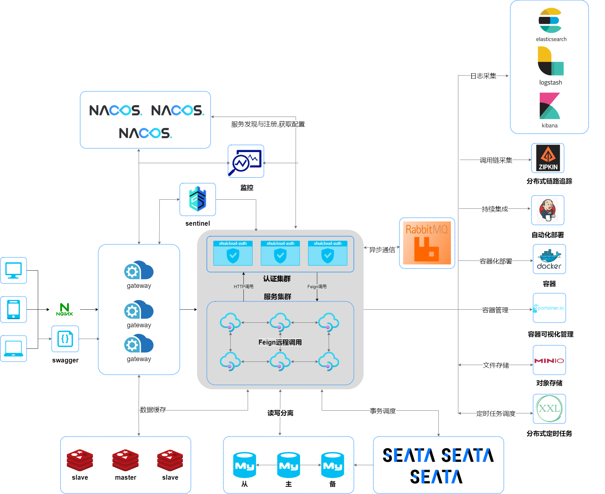

<p align="center">
      </br>
</p>
<h1 align="center" style="margin: 20px 20px; font-weight: bold;">XHuiCloud - 星辉云快速开发</h1> 

<p align="center">
  <a href="https://github.com/sindaZeng/XHuiCloud/blob/develop/LICENSE">
    
  </a>
  <a href="#">
    
  </a>
  <a href="#">
    
  </a>
  <a href="#">
    
  </a>
  <a href="#">
    
  </a>
  <a href="#">
    
  </a>
  <a href="https://mp.weixin.qq.com/cgi-bin/showqrcode?ticket=gQHz8DwAAAAAAAAAAS5odHRwOi8vd2VpeGluLnFxLmNvbS9xLzAybV9pT1JlRmxjUEUxMDAwMHcwN0UAAgTet0ZiAwQAAAAA">
    
  </a>
</p>


## 温馨提醒

> 1. **快速体验项目**：[在线访问地址](http://xhuicloud.cn/)
> 2. **接口文档**：[swagger在线](http://api.xhuicloud.cn/doc.html)
> 3. **项目文档**：[语雀](https://www.yuque.com/xinghuiyun/il5o2r)
> 4. **前端代码**：[Go](https://github.com/sindaZeng/xhuicloud-ui)

## 前言

本项目致力于采用现阶段流行技术，打造快速开发平台，做到适配各种场景的脚手架。

#### 项目介绍

星辉云是基于(SpringBoot + SpringCloudAlibaba + SpringAuthorizationServer + MyBatis-Plus) 支持Docker容器化部署，主要目的让我们注重业务，降低技术门槛，节省人力成本，缩短项目周期，提高工程的安全与质量。

#### 技术栈支持
- 基于`spring-security`RBAC权限验证
- 支持`OAuth2.0`协议授权校验
- 支持`Seata`分布式事务
- 支持`Nacos`注册中心
- 支持`Sentinel`
- 支持`灰度发布` 以及自定义灰度发布策略入口
- 支持`Mybatis-plus`多租户模式
- 支持`多数据源`，简单配置即可动态切换数据源
- 支持`Rabbit-mq` 并自动注册队列以及错误队列，以及通用发送组件
- 支持`redission`以及`zookeeper`的分布式锁
- 基于`zookeeper`分布式发号器
- 支持分布式任务`xxl-job`并且扩展使其可动态发布任务
- 支持分布式任务`elastic-Job`
- 支持`swagger`接口文档，ui界面使用`knife4j-ui`
- 支持`注解方式`对敏感信息进行脱敏打码
- 拥有超级强大的代码生成器`一键生成前后端代码`（控制层、持久层、视图层）
- 支持细化的按钮权限及数据权限以及客户端权限
- 支持`Amazonaws S3`协议的通用oss接口
- 支持`bom` 模块版本管理，尽可能的松耦合，方便模块升级、 增减模块


#### 模块规划(按顺序实现)

- [x] [认证中心(快速体验授权登录 U:admin P:123456)](http://oauth2.xhuicloud.cn/oauth2/authorize?client_id=test&response_type=code&scop=server&redirect_uri=http://xhuicloud.cn)
- [x] 用户管理
- [x] 角色管理
- [x] 部门管理
- [x] 菜单管理
- [x] 租户管理
- [x] 公共参数
- [x] 登录记录
- [x] 操作记录
- [x] 文件管理
- [x] 图库管理
- [x] 数据字典
- [x] 代码生成
- [x] 灰度发布 
- [x] 推送中心 
- [x] 监控平台
- [ ] 微信公众号运营管理(进度 70%)
- [ ] 基础运营系统
- [ ] OA办公自动化
- [ ] 聚合支付
- [ ] 大屏系统
- [ ] 报表系统
- [ ] 内容管理

#### 目录结构
```lua
XHuiCloud
├── XHuiCloud-auth                                          -- 认证服务器[16000]
└── XHuiCloud-commons                                       -- 公共模块 
     ├── XHuiCloud-common-authorization                     -- 认证授权模块
     ├── XHuiCloud-common-authorization-resource            -- 资源服务模块
     ├── XHuiCloud-common-core                              -- 公共核心模块
     ├── XHuiCloud-common-data                              -- 数据缓存模块
     ├── XHuiCloud-common-dds                               -- 动态数据源模块
     ├── XHuiCloud-common-elasticJob                        -- elasticJob自动配置模块
     ├── XHuiCloud-common-feign                             -- 公共feign
     ├── XHuiCloud-common-gateway                           -- 网关核心模块
     ├── XHuiCloud-common-gray                              -- 灰度发布
     ├── XHuiCloud-common-mqtt                              -- mqtt 模块
     ├   └── XHuiCloud-common-mqtt-server                   -- mqtt服务端
     ├── XHuiCloud-common-lock                              -- 分布式锁模块
     ├── XHuiCloud-common-log                               -- 公共日志核心
     ├── XHuiCloud-common-mybaits                           -- 数据源模块
     ├── XHuiCloud-common-oss                               -- 公共存储桶配置模块
     ├── XHuiCloud-common-rabbitMq                          -- rabbitMqp配置模块
     ├── XHuiCloud-common-sentinel                          -- 高可用的保证,限流降级模块
     ├── XHuiCloud-common-swagger                           -- 接口文档模块
     ├── XHuiCloud-common-seata                             -- 分布式事务模块
     ├── XHuiCloud-common-xxl                               -- XXL-JOB配置模块
     └── XHuiCloud-common-zero                              -- 分布式发号器
├── XHuiCloud-dependencies-bom                              -- 统一依赖管理
├── XHuiCloud-business                                      -- 系统管理业务模块
     ├── XHuiCloud-gateway                                  -- Api网关[15000]
     ├── XHuiCloud-generator                                -- 开发平台[21000]
     ├── XHuiCloud-logs                                     -- 日志服务器(18000)
     └── XHuiCloud-job                                      -- 定时任务
        └── XHuiCloud-job-api                               -- 定时任务公共api
        └── XHuiCloud-job-service                           -- 定时任务服务(19000)
     └──XHuiCloud-logs                                      -- 操作日志模块
        └── XHuiCloud-logs-api                              -- 操作日志公共api
        └── XHuiCloud-logs-service                          -- 操作日志服务(18000)
     └──XHuiCloud-pay                                       -- 支付中心模块
        └── XHuiCloud-pay-api                               -- 支付中心公共api
        └── XHuiCloud-pay-service                           -- 支付中心服务(23000)
     └──XHuiCloud-push                                      -- 统一推送中心模块
        └── XHuiCloud-push-api                              -- 统一推送中心公共api
        └── XHuiCloud-push-service                          -- 统一推送中心服务(22000)
     ├── XHuiCloud-register                                 -- 注册中心(13000)
     ├── XHuiCloud-monitor                                  -- 监控中心(9090)
     ├── XHuiCloud-sentinel-dashboard                       -- Sentinel监控模块(10101)
     ├── XHuiCloud-seata                                    -- 事务管理模块(8091)
     └── XHuiCloud-xxl-admin                                -- 定时任务管理模块(20000)
└── XHuiCloud-upms                                          -- 权限管理模块
     └── XHuiCloud-upms-api                                 -- 系统权限管理公共api模块
     └── XHuiCloud-upms-service                             -- 系统权限管理业务处理模块[17000]
```
### 架构

#### 系统架构图:


#### 业务架构图:
待整理


### 开发环境

| 工具          | 版本号 |
| ------------- | ------ |
| JDK           | 1.8    |
| Mysql         | 8.0.28 |
| Redis         | 6.2.6  |
| RabbitMQ      | 3.x      |
| Nginx         | 1.10   |
| Minio         |        |

## 交流

`XHuiCloud` 是遵从`MIT协议`完全开源免费的项目，由作者空闲时间开发，所以如果有写的粗糙的地方，可以发邮件加我好友，在帮助作者更方便地进行系统的开发，同时欢迎提问使用方面问题。

- 邮箱： `xhuicloud@163.com`
- 邮箱： `sindazeng@gmail.com`

## 鸣谢
- 感谢 JetBrains 提供的 License。     
  <a href="https://www.jetbrains.com/?from=smart-socket"></a>

## 许可证

[MIT](https://github.com/sindaZeng/XHuiCloud/blob/develop/LICENSE)

Copyright (c) <2021-2022> Sinda(xhuicloud@163.com)
